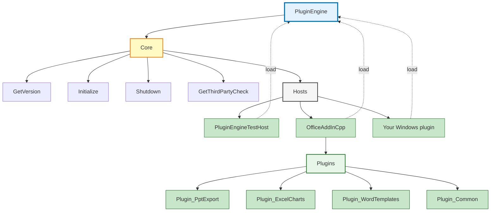

# windows-dll-plugin-template

A Windows x64 plugin DLL built with Visual Studio. Exposes a C API for version and lifecycle (`Initialize` / `Shutdown`). Use as a **template**: clone and rename the project to bootstrap a new plugin that uses third-party libraries (e.g. OpenCV).

**PowerPoint and Excel:** The **addins/OfficeAddInCpp** project is a **C++ COM add-in** (x64 only) for both PowerPoint and Excel. It loads the engine (PluginEngine.dll) and calls Initialize/Shutdown. Requires **64-bit Office**. See [docs/PPT_EXCEL_ADDINS.md](docs/PPT_EXCEL_ADDINS.md) and [addins/README.md](addins/README.md).

### Workflow (overview)

PluginEngine is the **origin**; hosts load it and can add multiple plugins. See [docs/ARCHITECTURE.md](docs/ARCHITECTURE.md) for details.

---

## How to run and use

### One-time setup (OpenCV)

1. **Get OpenCV** under `third_party/opencv` (run `scripts/download_opencv.sh` or [download](https://opencv.org/releases/) the Windows pack and install to `third_party/opencv`).
2. **Generate import libs** (official pack has no `.lib`): from repo root run  
   `scripts\generate_opencv_import_lib.bat`  
   or in PowerShell: `.\scripts\generate_opencv_import_lib.ps1`  
   Then rebuild. See [third_party/README.md](third_party/README.md) if OpenCV is elsewhere or you hit errors.

### Build

1. Open **PluginEngine.sln** in Visual Studio 2022.
2. Select **x64** and **Debug** (or Release).
3. **Build → Build Solution**.  
   Output: `PluginEngine\x64\Debug\PluginEngine.dll` (and OpenCV DLLs are copied there by post-build).

### Run the test host (recommended first check)

1. In Solution Explorer, right‑click **PluginEngineTestHost** → **Set as Startup Project**.
2. Press **F5** (or **Ctrl+F5** to run without debugger).  
   The test host loads the DLL, calls `PluginEngine_GetVersion`, `PluginEngine_Initialize`, `PluginEngine_GetThirdPartyCheck`, `PluginEngine_Shutdown`, then exits. You should see exit code 0.

### Use the DLL in your own app

1. Copy **PluginEngine.dll** (and the OpenCV DLLs from the same folder, e.g. `opencv_world410d.dll` for Debug) to your app’s directory or a path it loads plugins from.
2. Load the DLL with `LoadLibrary("PluginEngine.dll")`.
3. Get function pointers with `GetProcAddress` for:  
   `PluginEngine_GetVersion`, `PluginEngine_Initialize`, `PluginEngine_Shutdown`, `PluginEngine_GetThirdPartyCheck`.
4. Call `PluginEngine_Initialize()` once after load; call `PluginEngine_Shutdown()` before `FreeLibrary`.  
   See [docs/API.md](docs/API.md) for the full contract.

---

## Quick start (minimal)

1. Open **PluginEngine.sln** in Visual Studio 2022.
2. Choose **x64** and **Debug** (or Release).
3. Build Solution → DLL is at `PluginEngine\x64\<Configuration>\PluginEngine.dll`.
4. Set **PluginEngineTestHost** as startup project and run (F5) to test.

## Project layout

| Folder    | Contents                          |
|-----------|-----------------------------------|
| **PluginEngine/** | Engine DLL: `include/` (headers), `src/` (.cpp only) |
| **addins/OfficeAddInCpp/** | C++ COM add-in for PowerPoint and Excel; loads PluginEngine.dll. See [addins/README.md](addins/README.md). |
| **docs/**  | [README](docs/README.md), [Architecture](docs/ARCHITECTURE.md), [API](docs/API.md), [PPT_EXCEL_ADDINS](docs/PPT_EXCEL_ADDINS.md) |
| **tests/** | Test host app and [test instructions](tests/README.md) |

## Requirements

- Visual Studio 2022 (v143 toolset)
- Windows SDK 10.0
- Windows 10/11

For full build instructions, plugin usage, and API details, see **[docs/](docs/)**.

## Use as a DLL template

You can use this repo as a **template** for new Windows plugin DLLs:

- **Structure:** `include/` (public C API), `src/` (implementation), `docs/`, `tests/` (test host), `third_party/` (dependencies).
- **Third-party:** Add libraries under `third_party/` and follow [third_party/README.md](third_party/README.md) for wiring and for handling packs that ship only DLLs (generate import libs).
- **Rename:** Create a new solution/project or rename PluginEngine → YourPlugin (solution, project, folder, namespaces, and API prefix).
- **Docs:** [docs/logs.md](docs/logs.md) and [third_party/README.md](third_party/README.md) document the problems we hit (missing .lib, unresolved externals, .def parsing) and how to add new third-party software.
