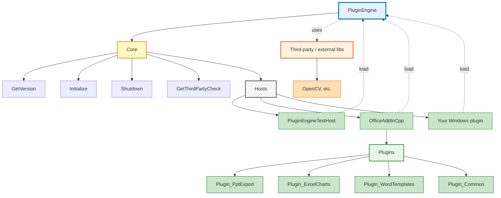

# Architecture

## PluginEngine hierarchy (build any Windows plugin on top)

**PluginEngine** is the **origin**: one core engine DLL at the top. Below it sits the **Core** (stable C API); hosts load the engine and can add multiple plugins. The engine (and your plugins) can **use third-party / external software** (e.g. OpenCV). Any Windows host (Office add-in, test host, or your own app) can build on top of it.



**Layers:**

| Layer | Role |
|-------|------|
| **PluginEngine (DLL)** | Core: C API (version, lifecycle, third‑party check). No UI, no host-specific code. |
| **Third-party / external** | External libs the engine or plugins use (e.g. OpenCV in `third_party/`). See [third_party/README.md](../third_party/README.md). Add your own for plugin development. |
| **PluginEngineTestHost** | Console .exe that loads the DLL and tests the API. Use for development and CI. |
| **OfficeAddInCpp** | COM add-in for PowerPoint/Excel (and Word). Loads PluginEngine.dll, provides ribbon/commands. Hosts **multiple in-process plugins** (e.g. PptExport, ExcelCharts, WordTemplates, Common)—add your own the same way. |
| **Your plugin** | Any Windows app or add-in that loads PluginEngine.dll and calls the C API. Same contract as the test host. |

To build a new Windows plugin on top: load `PluginEngine.dll` with `LoadLibrary`, resolve the exported symbols, call `PluginEngine_Initialize` after load and `PluginEngine_Shutdown` before unload. See [API.md](API.md).

---

## Directory layout

**Solution root (e.g. MyDll1/):**

```
├── PluginEngine/           # Engine DLL project
│   ├── include/           # Headers only
│   │   ├── framework.h    # Windows headers
│   │   ├── pch.h          # Precompiled header
│   │   └── PluginEngine_API.h   # Public plugin API
│   └── src/               # Implementation only (.cpp)
│       ├── pch.cpp        # PCH source
│       ├── dllmain.cpp    # DLL entry point
│       └── plugin_impl.cpp# Plugin API implementation
├── addins/OfficeAddInCpp/ # Office COM add-in (loads PluginEngine.dll)
├── docs/                  # Documentation (this file, API.md, etc.)
└── tests/                 # Test host and test docs
    └── PluginEngineTestHost/
```

- **PluginEngine/include/** holds all engine headers. No `.cpp` files here.
- **PluginEngine/src/** holds all engine `.cpp` files. No headers here; sources `#include` from `include/` via project include path.
- **docs/** and **tests/** live at solution root, not inside the PluginEngine folder.

## Layers

1. **API (include/PluginEngine_API.h)**  
   C-style, stable contract: version and lifecycle (`GetVersion`, `Initialize`, `Shutdown`). Exported via `PLUGINENGINE_API` (dllexport when building the DLL, dllimport when building the host).

2. **DLL entry (src/dllmain.cpp)**  
   Minimal `DllMain`: only process/thread attach/detach; optional storage of `hModule`. No allocation or heavy work.

3. **Implementation (src/plugin_impl.cpp)**  
   Implements the functions declared in `PluginEngine_API.h`. Internal logic can use C++; the host sees only the C API.

## Build

The project adds `$(ProjectDir)include` to **AdditionalIncludeDirectories**, so every `#include "pch.h"` or `#include "PluginEngine_API.h"` resolves from `include/` regardless of which `.cpp` in `src/` is compiling.

Precompiled header is created from `src/pch.cpp` using `pch.h` from `include/`.
